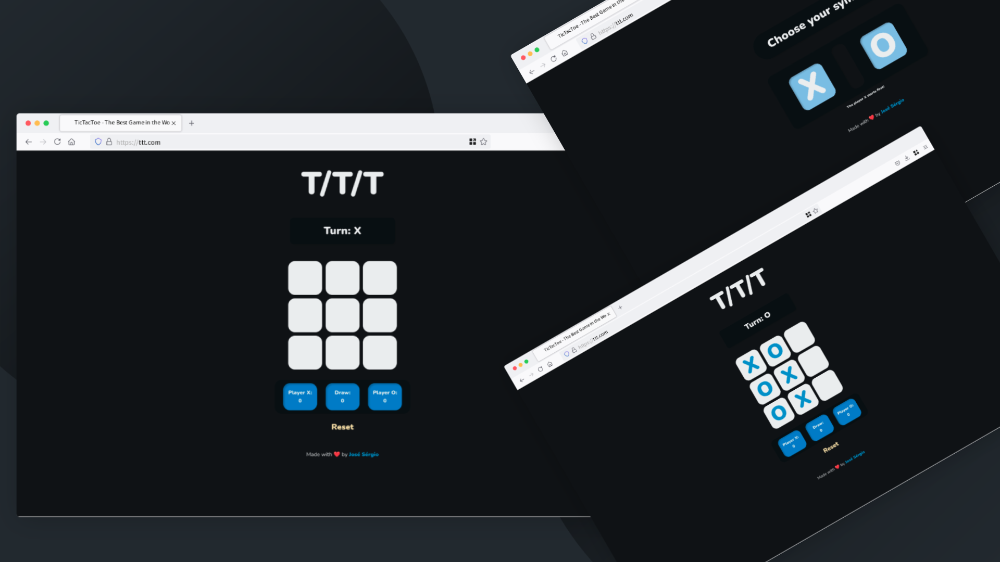

# PROJECT TicTacToe

## Description

This project is a TicTacToe game that can be played by two players. The game is played on a 3x3 grid. Each player takes turns marking a square on the grid. The first player to get three squares in a row wins. It was built using JavaScript, HTML, and CSS.

The project if part of the curriculum of [The Odin Project](https://www.theodinproject.com/lessons/node-path-javascript-tic-tac-toe).

## Preview

    
   

## Live Demo

[Live Demo Link](#)

## Features

- The game can be restarted at any time.
- Tracks the number of wins for each player.
- Track Draw games.
- Tracks the current player's turn.
-

## Built with

- 
- 
- 

## What I Learned

- I learned more about DOM manipulation.
- I learned how to use modules in JavaScript.

## Bugs

- After the game is restarded, the turn banner doesn't change.

## License

- MIT. See [LICENSE](/LICENSE) for more details.
- Copyrigth (c) 2023 [José Sérgio](https://github.com/MrEscappe)
